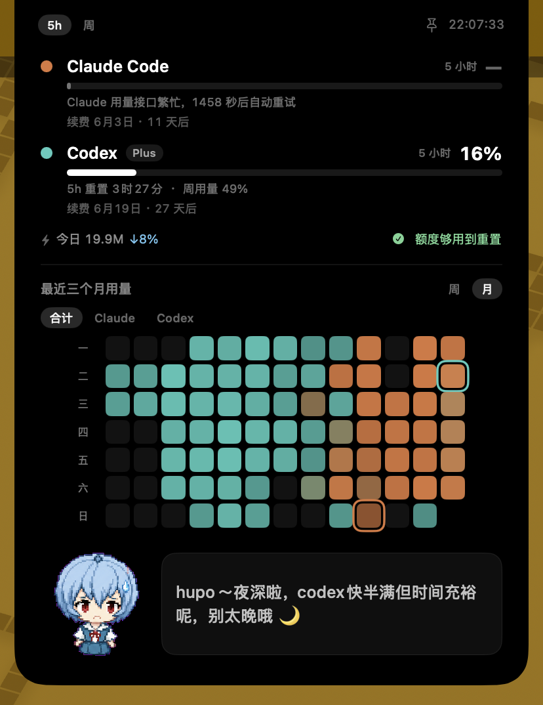
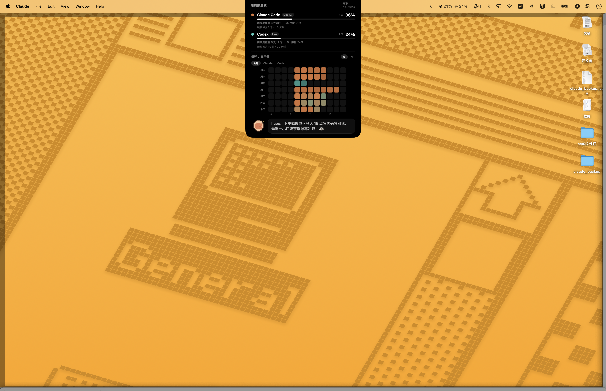

# Nibbi

把 **Claude Code** 与 **Codex** 的用量额度塞进 macOS 菜单栏的小工具。一眼看到两边的 5 小时额度还剩多少，不用切到终端敲 `/status`，也不用翻网页。

> 个人自用的精简版，灵感与 Claude / Codex 品牌图标来自 [steipete/CodexBar](https://github.com/steipete/CodexBar)。

<p align="center">
  
</p>

<p align="center">
  
</p>

<p align="center"><sub>鼠标移到刘海上，面板向下展开 —— 额度、续费、可切周/月的用量热力图，加底部那只会说俏皮话的像素小精灵</sub></p>

## 功能

- **菜单栏常驻** —— 直接显示 Claude 与 Codex 的 5 小时额度百分比；平时黑色低调，剩余额度 ≤10% 时转红示警。
- **下拉菜单** —— 5 小时 / 7 天额度进度条 + 重置倒计时，一键「立即刷新」。
- **刘海悬浮面板**（带刘海的 Mac）—— 鼠标移到刘海上即展开，显示额度、订阅套餐、续费倒计时，以及用量热力图。
- **用量热力图** —— 悬浮面板里的图表顶部可切「周 / 月」：周视图为最近 7 天 × 12 个 2 小时段，月视图为近三个月（13 周）的 GitHub 贡献图样式。Claude 与 Codex 的区分方式可在设置里选「双色合并」（每格按主导方在橙 ↔ 青之间着色）或「切换显示」（顶部按钮切 合计 / Claude / Codex）。
- **订阅套餐自动识别** —— Claude 套餐读自本机钥匙串凭证，Codex 套餐读自官方接口，无需手动配置。
- **像素小精灵** —— 面板底部住着一只像素吉祥物：会浮动眨眼、随光标左右转头，鼠标悬停会凑近，点一下会蹦起来、迸星星并换它说的俏皮话；生成文案时进入思考态，新文案出来会短暂庆祝，额度告急（5 小时用量 ≥85%）时冒汗发愁、临界或读取出错时示警，深夜还会犯困打盹。
- **DeepSeek 俏皮总结**（可选）—— 小精灵每 30 分钟结合用量、重置/续费时间、本周写码节奏，说一句俏皮的中文提醒，打字机逐字浮现。
- **玻璃质感设置窗口** —— 菜单「设置…」打开磨砂玻璃风格窗口：日历选续费日、给小精灵起对你的称呼、填 DeepSeek Key。

## 环境要求

- macOS 13 及以上（刘海面板需要带刘海的机型，其余功能不挑机型）
- Swift 6 工具链（Xcode 16+ 或独立 Swift toolchain）
- 已在终端登录过 `claude` 与 `codex` CLI —— 用于读取本地凭证

## 构建与安装

```bash
git clone https://github.com/by4hp/codexbar-mini.git
cd codexbar-mini
./build.sh
open Nibbi.app
```

装进「应用程序」：

```bash
cp -r Nibbi.app /Applications/ && open /Applications/Nibbi.app
```

App 没有 Dock 图标，只待在菜单栏。

## 配置 DeepSeek 俏皮总结（可选）

不配置也能正常用，只是看不到面板底部那行俏皮话。

1. 到 [DeepSeek 开放平台](https://platform.deepseek.com/api_keys) 申请一个 API Key。
2. 把 Key 填进去，两种方式任选其一：
   - 点菜单栏图标 →「设置…」→ 填入 DeepSeek API Key（推荐）；
   - 或直接编辑 `~/.nibbi/config.json`（首次运行 App 会自动生成模板）的 `deepseek_api_key` 字段。

3. 文案在启动后生成一次，之后每 30 分钟刷新；点菜单里的「立即刷新」也会重新生成。

用的是 `deepseek-v4-flash` 模型并关闭了思考模式，单次约 30 token，成本基本可忽略。

## 个性化

点菜单栏图标 →「设置…」：

- **订阅套餐** —— 自动识别，只读展示，无需配置。
- **每月续费日** —— 在日历上给 Claude 与 Codex 各选一天。
- **悬浮窗图表** —— 选 Claude / Codex 的区分方式（双色合并 / 切换显示）与默认时间范围（最近 7 天 / 最近三个月）；时间范围也能在图表顶部直接切换。
- **称呼** —— 小精灵在俏皮总结里怎么称呼你。
- **DeepSeek API Key** —— 填了才有俏皮总结。

所有设置保存在 `~/.nibbi/config.json`，也可直接手编。旧版 `~/.dee_codexbar/config.json` 会在首次启动时自动迁移。

## 隐私说明

- 额度数据来自各家**官方接口**：Claude 走 `api.anthropic.com/api/oauth/usage`，Codex 走 `chatgpt.com/backend-api/wham/usage`；凭证从本机钥匙串 / `~/.codex/auth.json` 读取，只用于这两个请求。
- 热力图通过扫描本地会话日志（`~/.claude/projects`、`~/.codex/sessions`）统计近三个月的 token，**全程在本机完成**。
- 仅当你配置了 DeepSeek Key 时，才会把**用量百分比、续费日期等概要信息**（不含任何代码或对话内容）发送给 DeepSeek 用于生成文案。

## 项目结构

| 文件 | 作用 |
| --- | --- |
| `Usage.swift` | 读取凭证、拉取 Claude / Codex 官方用量接口与套餐等级 |
| `History.swift` | 扫描本地会话日志，聚合近 13 周 token 用量（供周/月热力图） |
| `Config.swift` | 读写 `~/.nibbi/config.json`（续费日、称呼、DeepSeek Key、图表偏好） |
| `Subscription.swift` | 每月续费日的日期计算 |
| `Quip.swift` | 以小精灵口吻调用 DeepSeek 生成俏皮总结 |
| `PixelPet.swift` | 像素小精灵：精灵图、表情帧与交互动效 |
| `Settings.swift` | 玻璃质感「设置」窗口 |
| `AppDelegate.swift` | 菜单栏图标、下拉菜单、定时刷新 |
| `NotchController.swift` / `NotchPanel.swift` | 刘海悬浮面板的定位与界面 |

## 致谢

灵感与 Claude / Codex 品牌图标来自 [steipete/CodexBar](https://github.com/steipete/CodexBar)。

## License

[MIT](LICENSE)
