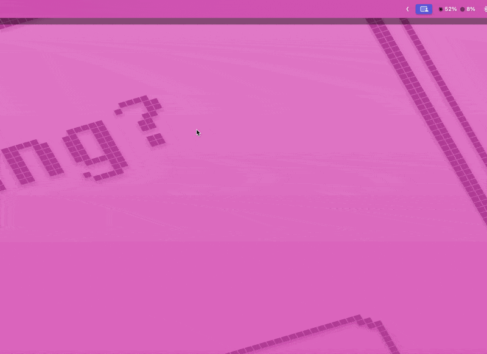
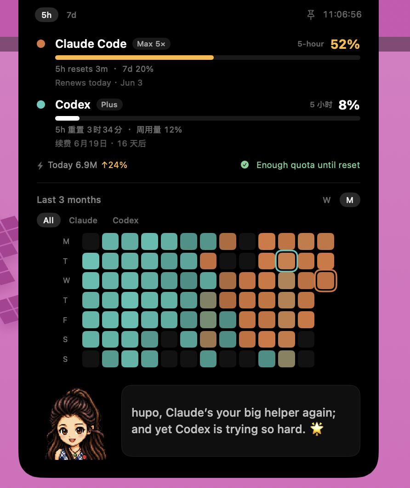

# HeyCC

<p align="right"><a href="README.md">English</a> · <a href="README.zh.md">中文</a></p>

A tiny macOS menu bar tool that puts the usage quotas of **Claude Code** and **Codex** right in your menu bar. See at a glance how much of each side's 5-hour quota is left — no need to switch to the terminal and type `/status`, no need to dig through a web page.

> A trimmed-down personal build. Inspiration and the Claude / Codex brand icons come from [steipete/CodexBar](https://github.com/steipete/CodexBar).

<p align="center">
  
</p>

<p align="center">
  
</p>

<p align="center"><sub>Move the cursor over the notch and the panel slides down — quota, renewal countdown, a weekly/monthly usage heatmap, plus a pixel sprite at the bottom that drops witty one-liners</sub></p>

## Features

- **Lives in the menu bar** — shows the 5-hour quota percentage for Claude and Codex directly; subtle black by default, turning red to warn you when the remaining quota drops to ≤10%.
- **Dropdown menu** — 5-hour / 7-day quota progress bars plus reset countdowns, with a one-click "Refresh now".
- **Notch hover panel** (on Macs with a notch) — move the cursor over the notch to expand it, showing quota, subscription plan, renewal countdown, and the usage heatmap.
- **Usage heatmap** — the chart at the top of the hover panel toggles between "Week / Month": the weekly view is the last 7 days × twelve 2-hour slots, while the monthly view is a GitHub-contribution-style grid of the last three months (13 weeks). How Claude vs. Codex are distinguished can be set to "two-color merge" (each cell shaded between orange ↔ cyan by the dominant side) or "toggle display" (a button at the top switches between Total / Claude / Codex).
- **Automatic subscription detection** — the Claude plan is read from the local keychain credentials, the Codex plan from the official API; no manual setup needed.
- **Pixel sprite** — a pixel mascot lives at the bottom of the panel: it floats and blinks, turns its head to follow the cursor, leans in on hover, and when clicked it hops up, bursts into stars, and swaps to a new quip. It enters a thinking state while generating text, briefly celebrates when a new line appears, breaks into a worried sweat when the quota runs low (5-hour usage ≥85%), warns you at critical levels or read errors, and dozes off late at night.
- **DeepSeek witty summaries** (optional) — every 30 minutes the sprite combines your usage, reset/renewal times, and the week's coding rhythm into a witty one-liner (in Chinese), revealed character by character like a typewriter.
- **Glass-style settings window** — "Settings…" in the menu opens a frosted-glass window: pick renewal days on a calendar, set what the sprite calls you, and enter your DeepSeek key.

## Requirements

- macOS 13 or later (the notch panel needs a notch-equipped Mac; the rest works on any model)
- Swift 6 toolchain (Xcode 16+ or a standalone Swift toolchain)
- Already signed in to the `claude` and `codex` CLIs in your terminal — used to read local credentials

## Build & install

```bash
git clone https://github.com/by4hp/codexbar-mini.git
cd codexbar-mini
./build.sh
open HeyCC.app
```

Install into your Applications folder:

```bash
cp -r HeyCC.app /Applications/ && open /Applications/HeyCC.app
```

The app has no Dock icon — it stays in the menu bar.

## Configure DeepSeek witty summaries (optional)

Everything works without it; you just won't see that witty line at the bottom of the panel.

1. Get an API key from the [DeepSeek open platform](https://platform.deepseek.com/api_keys).
2. Add the key in one of two ways:
   - Click the menu bar icon → "Settings…" → enter the DeepSeek API Key (recommended); or
   - Edit the `deepseek_api_key` field directly in `~/.heycc/config.json` (a template is auto-generated the first time you run the app).

3. The text is generated once at startup, then refreshed every 30 minutes; clicking "Refresh now" in the menu also regenerates it.

It uses the `deepseek-v4-flash` model with thinking mode off — about 30 tokens per call, so the cost is essentially negligible.

## Personalization

Click the menu bar icon → "Settings…":

- **Subscription plan** — auto-detected, read-only, no configuration needed.
- **Monthly renewal day** — pick a day on the calendar for each of Claude and Codex.
- **Panel chart** — choose how Claude / Codex are distinguished (two-color merge / toggle display) and the default time range (last 7 days / last three months); the time range can also be switched right at the top of the chart.
- **Nickname** — what the sprite calls you in its witty summaries.
- **DeepSeek API Key** — required for witty summaries.

All settings are saved in `~/.heycc/config.json` and can be edited by hand. Legacy `~/.nibbi/config.json` and `~/.dee_codexbar/config.json` files are automatically migrated in order on first launch.

## Privacy

- Quota data comes from each vendor's **official API**: Claude via `api.anthropic.com/api/oauth/usage`, Codex via `chatgpt.com/backend-api/wham/usage`; credentials are read from the local keychain / `~/.codex/auth.json` and used only for these two requests.
- The heatmap is computed by scanning local session logs (`~/.claude/projects`, `~/.codex/sessions`) for tokens over the last three months — **entirely on your machine**.
- Only when you have configured a DeepSeek key does it send **summary info such as usage percentages and renewal dates** (no code or conversation content whatsoever) to DeepSeek to generate the quips.

## Project structure

| File | Purpose |
| --- | --- |
| `Usage.swift` | Reads credentials, fetches the Claude / Codex official usage APIs and plan tiers |
| `History.swift` | Scans local session logs, aggregates the last 13 weeks of token usage (for the weekly/monthly heatmap) |
| `Config.swift` | Reads/writes `~/.heycc/config.json` (renewal days, nickname, DeepSeek key, chart preferences) |
| `Subscription.swift` | Date math for the monthly renewal day |
| `Quip.swift` | Calls DeepSeek to generate witty summaries in the sprite's voice |
| `PixelPet.swift` | The pixel sprite: sprite sheets, expression frames, and interaction animations |
| `Settings.swift` | The glass-style "Settings" window |
| `AppDelegate.swift` | Menu bar icon, dropdown menu, scheduled refresh |
| `NotchController.swift` / `NotchPanel.swift` | Positioning and UI of the notch hover panel |

## Credits

Inspiration and the Claude / Codex brand icons come from [steipete/CodexBar](https://github.com/steipete/CodexBar).

## License

[MIT](LICENSE)
